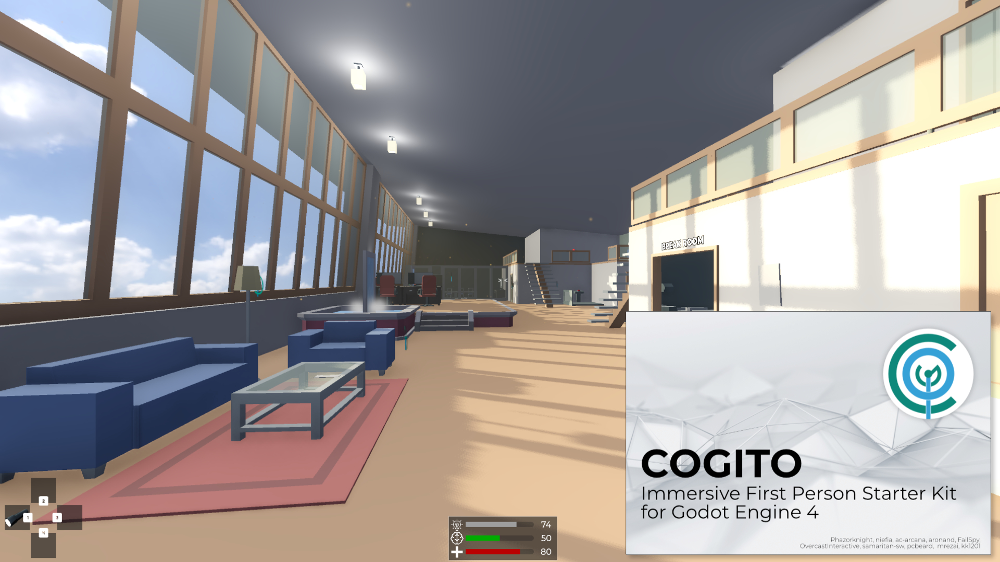

# COGITO
 

## What is it?
Cogito is a First Person Immersive Sim Template Project for Godot 4, providing a framework for creating interactable objects, various items to use and mechanics to influence the player and game environment.
In short, with COGITO you get a quick start for a fully-featured first person game with a great variety of mechanics and a solid base to create your own.

### [Online documentation](https://cogito.readthedocs.io/en/latest/index.html)
### [Video tutorial series](https://cogito.readthedocs.io/en/latest/tutorials.html)
### [Cogito in the Godot Asset Store (beta)](https://store-beta.godotengine.org/asset/philip-drobar/cogito)

### Current Features
- First person player controller with:
  - Sprinting, jumping, crouching, sliding, stairs handling, ladder handling, sitting
  - Lots of exposed properties to tweak to your liking (speeds, headbob, fall damage, bunnyhop, etc.)
  - Easy-to-use dynamic footstep sound system
- Player Attribute System
  - Health, Stamina, Visibility for stealth, etc
  - Customize how attributes get displayed in the HUD (or stay hidden)
  - Also useable for RPG-like attributes (Strength, Wisdom, etc)
  - Interactions can check attributes (eg. you can only lift a box if you're strong enough)
- Interaction System
  - Component-based interactions makes it easy to turn your own objects interactive quickly and customize existing ones
  - Examples for interactive objects like doors, drawers, boxes to carry, turn-wheels, elevators, notes, keypads
- Inventory System
  - Flexible resource-based inventories
  - Grid-based (think Resident Evil 4)
  - Inventory UI separate from inventory logic
  - Examples for multiple item types (consumables, keys, ammo, weapons, combinable Items)
  - Base class to easily add your custom item types
  - Containers with their own inventories
- Basic NPC
  - NavigationAgent based enemy with component-based state machine + animation states
  - Simple player detection system that uses detection areas + basic line-of-sight checks
- Main menu, pause menu and Options menu
- Rebindable controls
- Full game pad support!
- Save and Load System as well as scene persistency
- Support for other plugins:
  - Works with Dialogic
  - Works with Dialgue Manager
- Work in progress:
  - Systemic Properties (wet/dry, flammable/on fire, soft, etc) (very WIP)
  - Basic Quest System

### Comes with fully featured Demo Scenes
- Set up like a game level including a variety of objects, weapons and quests
- Demo scenes contains hints that explain how objects in the scene were set up

COGITO is made by [Philip Drobar](https://www.philipdrobar.com) with help from [these contributors](https://github.com/Phazorknight/Cogito/graphs/contributors).

## Principles of this template
The structure of this template always tries to adhere to the following principles:
- **Complete**: When you download COGITO and press play, you get a functioning project out of the box. Game menu, save slot select, options and a playable level are all included.
- **Versatile**: Whether your game is set in the future, the past or the present, use melee, projectile or no weapons at all, have low poly, stylized or realistic graphics, the template will have features for you.
- **Modular**: Do not want to use a feature? You will be able to hide it, ignore it or strip it out without breaking COGITO. At the same time, COGITO is designed to be extendable with your own custom features or other add-ons.
- **Approachable**: While there will always be a learning curve, we strive to make COGTIO approachable and intuitive to use, so it doesn't get in your way of making your game.

> [!IMPORTANT]  
> COGITO v1.1 is not 100% bug-free. While most features are set, be aware that this is hobbyist open source software. Use at your own risk and check Issues and Discussion pages for more information.

[Credits, Contributors and License](https://cogito.readthedocs.io/en/latest/about.html)
