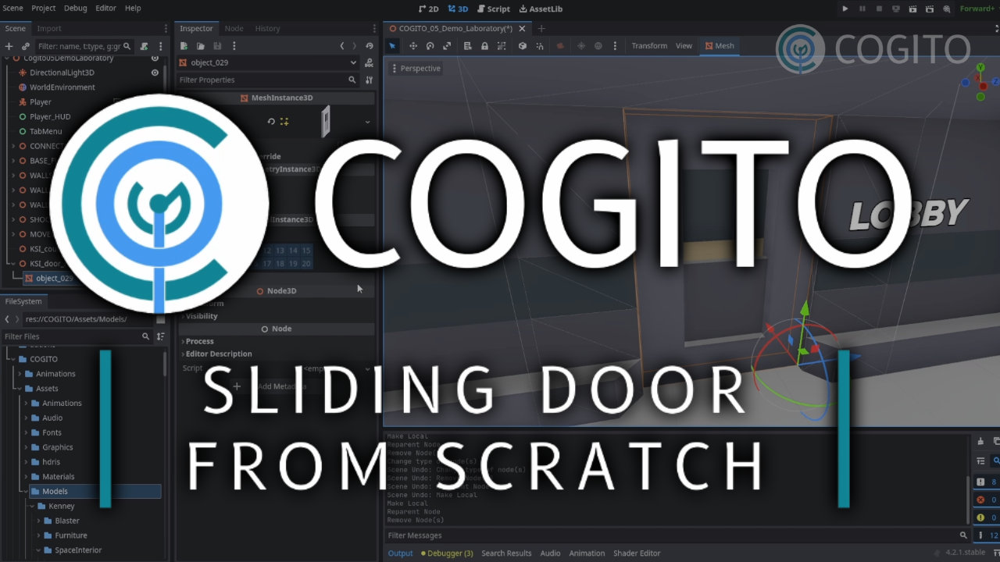

# COGITO
 
COGITO is made by [Philip Drobar](https://www.philipdrobar.com) with help from [these cool people](https://github.com/Phazorknight/Cogito/graphs/contributors).

v202403.22

COGITO is a first Person Immersive Sim Template Project for Godot Engine 4.
In comparison to other first person assets out there, which focus mostly on shooter mechanics, COGITO focuses on
providing a framework for creating interactable objects and items.

### Current Features
- First person player controller with:
  - Sprinting, jumping, crouching, sliding, stairs handling, ladder handling
  - Fully customizable attributes like Health, Stamina, Visibility (for stealh) - Component based, so easy to add your own.
  - Lots exposed properties to tweak to your liking (speeds, headbob, fall damage, bunnyhop, etc.)
  - Easy to use dynamic footstep sound system
- Inventory System
  - Flexible resource based inventories
  - Inventory UI separate from inventory logic
  - Examples for multiple item types (consumables, keys, ammo, weapons, combinable Items)
  - Base class to easily add your custom item types
- Interaction System
  - Component based interactions makes it easy to turn your own objects interactive quickly and customize existing ones
  - Examples for interactive obects like doors, drawers, carryables, turn-wheels, elevators, readable objects, keypads
- Quest System
- Saven and Load System as well as scene persistency
- Full gamepad support!
- Fully featured Demo Scene
  - Set up like a game level including a variety of objects, weapons and quests
  - In-game helper documents that explain how objects in the scene were set up

> [!IMPORTANT]  
> COGITO is still under active develompent. While some features are pretty much set, others might change soon. Use at your own risk and check Issues and Discussion pages for more information.

**(OLD) Video giving an overview of features: [COGITO Overview](https://www.youtube.com/watch?v=LYBo1_Qfru0)

## [Documentation](docs/documentation.md)

## Videos

## Thanks and Contributions
- AC-Arcana: added DynamicFootstepSystem
- pcbeard: Performance tweaks and bugfixes.
- FailSpy: improved input handling as well as UI and Player Controller quality-of-life fixes.
- kk1201: improving Lightzone component.

- Player controller is based on Like475's First Person Controller Advanced: https://github.com/Like475/fpc-godot
- Menus are based on SavoVuksan's EasyMenus (also see this link for documentation): https://github.com/SavoVuksan/EasyMenus
- Inventory system was helped by following DevLogLogan on Youtube: https://www.youtube.com/watch?v=V79YabQZC
- InputHelper by Nathan Hoad (also see this link for documentation): https://github.com/nathanhoad/godot_input_helper
- QuickAudio by Bryce Dixon (https://github.com/BtheDestroyer/Godot_QuickAudio)
- Stairs handling based on GodotStairs by elvisish (https://github.com/elvisish/GodotStairs)
- Cogito Quest System based on shomykohai's Godot 4 quest system.

## License and Credits
- This add-on is published under the MIT license.
- You can use this add-on in your projects, personal or commercial, as long as you credit us (mostly cause I'd love to see what people use it for!)
- About the game assets under the COGITO/assets folder:
  - 3D models are by Kenney (https://www.kenney.nl/) or made by me.
  - Audio is either by Kenney or from freesound.org used under CC0 or MIT license
  - Cloud HDR (kloofendal_48d_partly_cloudy_puresky)2k.hdr by Greg Zaal, used under CC0.
  - All other included assets either made by me or one of the contributors, published under MIT.
