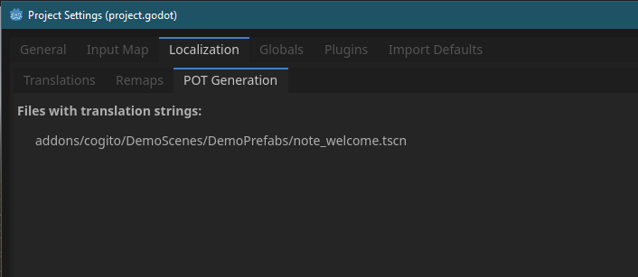

Frequently Asked Questions
==========================

My question isn't answered here?
--------------------------------

* If you have a feature request, please post in the `Discussions <https://github.com/Phazorknight/Cogito/discussions>`_ page on the GitHub repo.
* If you have found a bug, please create an Issue on the GitHub `Issues <https://github.com/Phazorknight/Cogito/issues>`_ page.
* This FAQ is still a work in progress, but I try to add answers to the most common questions as they come up.

I am new to Godot. Should I use Cogito?
---------------------------------------

You don't have to be a pro, but you should have some basic familiarity on how Godot works.
Before using Cogito, it would help if you had knowledge about the following:

* Basics of Godot Editor and the engine itself (Editor Tabs, Scenes and Nodes, Inspector)
* How Signals work
* Instantiating packed scenes and creating resources.

Is this a full game?
--------------------

No. As each game is different and has a variety of needs, it's not possible to offer a fully featured game.
However, Cogito offers everything to get you started with a complete framework and foundation to customize or
add any features you need.

.. tip::
   If you happen to create a feature for your Cogito game that could be used for others, consider creating a pull request! A lot of features were added to Cogito this way and every user benefits from it!
   Even if the implementation is not perfect, a pull request can get the repo mantainer's eyes on it to adjust and integrate the feature into Cogito properly.

Can I make [insert genre here] with this?
-----------------------------------------

If it's a 3D and ideally a first-person game, then the answer is probably yes. I would recommend playing the included demo scenes and seeing if the type of featuers match your project.
The more overlap there is, the more likely it is that Cogito will work for your project.
Note that if you're an experienced programmer, you can modify Cogito to make it work with almost any kind of 3D game.

My inputs aren't working!
-------------------------

Have you set up the project input map?
Please see the section about **initiatlizing the input map** in the **Getting Started** section.

My carryable object doesn't behave as I expect
----------------------------------------------

In 9 out of 10 cases, this is a Godot physics issue rather than a Cogito issue. We recommend playing around with
RigidBody3D properties or using Jolt physics.

How do I set the main menu to start/load my own level scene?
------------------------------------------------------------

Open the ``main_menu.tscn`` and find the ``MainMenu_SaveSlotManager`` node. There you can set a ``path`` to the scene you want to load first when a new game is started.

My own objects aren't working!
------------------------------
There are a few reasons for them to not be working, so here's a checklist:

* Make sure whatever cogito object script you're using is attached to a Node of the right type. It'll need to be a node that inherits CollisionObject3D.
* Make sure your interactive object has a ``CollisionShape3D`` and is set to the right layers.
* Make sure your interactive object is a ``Cogito_Object`` or similar (``Cogito Door``). This is necessary for Cogito's interaction system to pick it up.
* Make sure you have interaciton components attached to the root node of your object. Use a default included component to make sure it works (``CarryableComponent`` is the quickest)
* Make sure your object is saved as it's own scene. It is not strictly necessary for all object-types, but can help with some issues.

I can't drop items / my level behaves oddly.
--------------------------------------------

Make sure you have the ``cogito_scene.gd`` script attached to the root node of your level scene.
COGITO uses this to identify which node is the parent to spawned objects (like dropped items).

How do I get a reference to the player?
---------------------------------------
There are multiple ways to get a reference to the player node.
* Pass the player node directly with your signal/method. For example, if you use a node that has body_entered / body_exited signals, then these signals pass a ``body`` argument which references the node. You can then easily check if it's in the group "Player" to make sure you have the player node.
* Find the node that's in the "Player" group.
* In a pinch you can use the CogitoSceneManager. The CogitoSceneManager autoload saves a reference to the current player and current cogito scene. These get updated whenver a cogito scene loads. To reference the player in a script this way, write ``CogitoSceneManager._current_player_node`` and ``CogitoSceneManager._current_scene_root_node``.

Where do I set Weapon Damage?
-----------------------------

Weapon Damage is set on the WieldableItem resource. This value is then either used in the Wieldable script itself or passed onto spawned projectiles.
It is NOT set on the wieldable script and also not set on the projectile itself (if a projectile based weapon).

I'm using POT generation in my localizations but strings aren't showing up!
---------------------------------------------------------------------------

 As POT generation works by resource, you need to make sure to add each individual packed scene object to it. Keep in mind that packed scenes within scenes don't seem to get properly detected by the POT generator.

Another issue of using POT is that if you translate strings within reused packed scene components, those translation will be applied to all instances of them. This is probably fine for stuff like the interaction prompts like "Read this", but you don't want all your readable objects have the same content.

In order for this to work you will have to make the readable component "local" to your object.

As an example I've taken the ``Note_Welcome`` object from the Lobby demo scene. It contains a PackedScene of a ``ReadableComponent``.
So for me to make the contents of that component show up in the POT generation and have these only apply to the ``Note_Welcome``, I'll have to turn the ``ReadableComponent`` local.

Note how the names of the child nodes of the ``ReadableComponent`` are white as they are now all part of the ``Note_Welcome`` scene.

Then I add the Note_Welcome scene to the POT Generator resources:

In the end, all these strings now show up in the POT file:

So in summary: It's doable but needs some planning in how you structure your objects and their components.
I'd also wait until the very end of your project before generating the POT file as making your PackedScenes local will make you lose them being instances to the same PackedScene, which could make editing tedious.