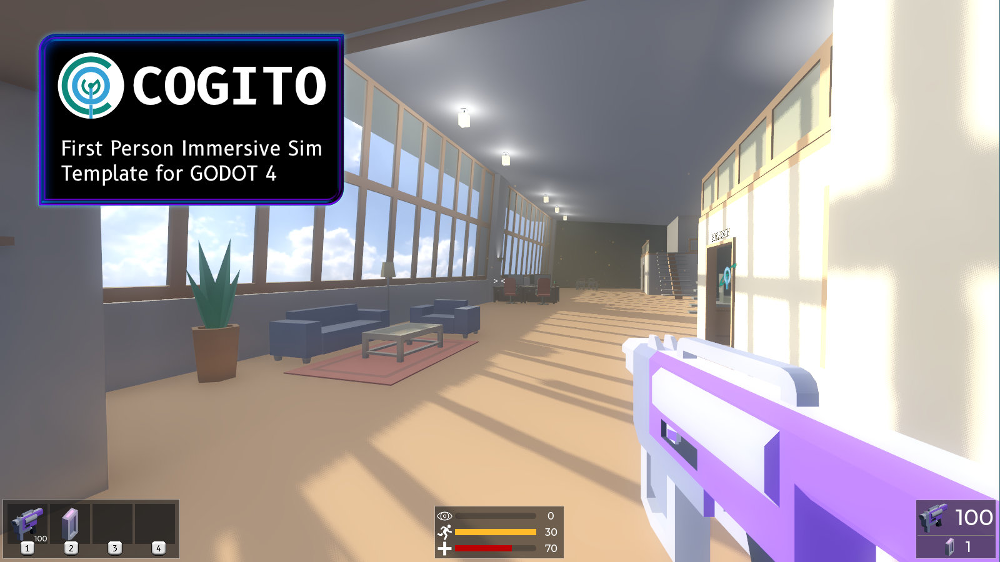

.. Cogito documentation master file, created by
   sphinx-quickstart on Wed May 22 21:51:57 2024.
   You can adapt this file completely to your liking, but it should at least
   contain the root `toctree` directive.

COGITO
======

.. toctree::
   :maxdepth: 2
   :hidden:
   :caption: Contents:

   about
   gettingstarted
   manual
   tutorials
   faq

------------

COGITO is a first Person Immersive Sim Template Project for Godot Engine 4. 
In comparison to other first person assets out there, which focus mostly on shooter mechanics, COGITO focuses on providing a framework for creating interactable objects and environments.

COGITO is made by `Philip Drobar <https://www.philipdrobar.com>`_ with help from `these contributors <https://github.com/Phazorknight/Cogito/graphs/contributors>`_.

.. note::
   No GenerativeAI was used in the making of this project. Made by humans for humans.

.. caution::
   COGITO is still under active development. While some features are pretty much set, others might change soon. Use at your own risk and check Issues and Discussion pages for more information.