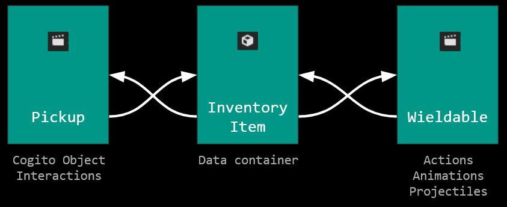

******
Manual
******

.. tip::
   This documenation will give you an overview of the most important properties & methods of the different nodes and how to use them. This documentation does not always list each and every function or exposed property, as these are better explored in the editor itself and include tooltips on how to use them. If you want to dive deeper into the code, you can also read the comments in the source code.

.. note::
   While COGITO is designed with modularity and versatility in mind, it is usually easier to modify the included systems than try to make it work with other external systems (like using a different inventory system or player controller). The most common tasks most users will run into is adapting their own assets and levels to work with COGITO. I'm in the process of creating video tutorials for these cases which should help you get started quickly.

Player Controller
=================
COGITO includes a first person player controller that has a variety of parameters and settings built-in. We recommend just reading through the descriptions and tweaking the parameters to your liking. Most common adjustments needed are walking, running and sprinting speeds, stair handling, and ladder handling. Be aware that a few of the player controller parameters will be controlled by the game options and are thus user controlled (for example Invert Y Axis).

**Default controls:**

* W A S D - Moving the character
* Space - Jump
* Shift - Sprint
* C - Crouch
* F / E - Interact / Interact2
* ESC - Pause Menu
* Tab - Inventory
* 1/2/3/4 - Quick Slots
* Left Mouse Button / Right Mouse Button - Primary Action / Secondary Action

.. tip::
   Invert Mouse Y is set in the in-game options menu and saved in the game's config file. Be aware that the built game will have it's own config file so this setting might "reset". 

Cogito Player Packed Scene
--------------------------
You can find a pre-setup packed scene at ``/addons/cogito/PackedScenes/cogito_player.tscn``. It is pre-configured to suit most needs with little tweaking. This is all you need to add to a scene to get it to run via F6.
If you look inside the packed scene you will find several components for the various systems of COGITO.

Cogito Player class
-------------------
This is the base class of the included first person player controller. You find a lot of important parameters in this, and most of them have tooltips to explain what they control.

**Node References**

The player needs a reference to the Player HUD node and the Pause Menu node. These should be included in the player scene as default.

**Audio**

Controls movement sounds as well as volume and certain thresholds. Be aware that the actual footstep sounds are controlled by the dynamic footstep sound system.

**Movement Properties**

Most of these are self-explanatory, and we encourage you to experiment.

**Head bob Properties**
Controls the dynamic head bob. The main head bob strength setting is controlled in-game in the options menu. The rest of the values are then multiplied by that setting.

**Stair Handling**

The most essential setting here is the step height, which controls what the player controller will consider a step. Also be aware that the player collision shape plays a big role in stair handling for correct edge detection.
This is the reason the included player controller has a box/cylinder collider as its collision shape.

**Ladder Handling**

Controls movement settings while player is on a ladder.

**Game pad Properties**

These will only affect game pad input.

HUD and UI
==========
COGITO comes with an included themed UI. Except for a handful of hard references (see Player Controller), the UI was designed to be decoupled from most systems, which should enable you to easily modify or substitute it.

Main Menu
---------
The Main Menu scene is meant to be the first menu the player sees when starting the game.
It directly displays several game slots as well as additional buttons like `Options` and `Quit`.
In addition to the UI elements, it includes a Save Slot Manager node that handles save slot management. This node is needed for the save slot buttons to work In addition to the UI elements, it includes a Save Slot Manager node that handles save slot management. This node is needed for the save slot buttons to work correctly.

Save Slot Buttons
~~~~~~~~~~~~~~~~~

Save Slot buttons are their own scenes with an attached script that includes some settings for COGITO's save system as well as a reference to the Save Slot Manager.
To add more slots, simply add another Save Slot Button, set the reference to the Save Slot Manager and give the slot a name. Make sure no two save slot buttons share the same save slot name, or they will reference the same save slot!

Options
~~~~~~~
The `Options` button displays the Options Menu, which in turn is its own scene, to make sure it is the same as the one that the Pause Menu opens. See ``Options`` for more info.

Pause Menu
----------
The Pause Menu will open if the player presses ESC / Menu while in game.
Per default, it will provide options to save or load the current slot, set options, return to the main menu or quit the game.

The current slot is determined by which active slot is set in the Cogito Scene Manager (see `Scene Setup and Management`)
If the current slot has a saved game, it will show a screenshot and the time/date of the save.

Options Menu
------------
The Options Menu is its own scene called `OptionsTabMenu`.
COGITO comes with a handful of included options that range from gameplay and control settings to graphics and audio settings.
All the options are controlled and set in the CogitoTabMenu script that's attached to the root node of this scene.
Options are saved in a cfg file, so they are save slot independent.

Adding your own options
~~~~~~~~~~~~~~~~~~~~~~~
To add your own options, edit the ``OptionsTabMenu.gd`` and add your own methods.
Make sure you add any new values to the ``save_options()`` and ``load_options()`` methods, as well as to the ``options_constants.gd`` file, to make sure they are saved/loaded correctly.
Then add buttons to the OptionsTabMenu as needed and use their signal to control the methods you've added to ``OptionsTabMenu.gd``.

COGITO Attributes
=================
``COGITO Attributes`` are a custom class used to save and manipulate data most commonly used to represent some kind of numerical attribute. Most common examples are values like health points, stamina, magic, etc. These are usually tied to the player but not exclusively. For example you can use the health attribute on any objects that you want to receive damage. The included specific attributes come as component nodes you can simply instantiate as child nodes to any object.

CogitoAttribute base class
--------------------------
The base class used for any attributes is the ``CogitoAttribute`` class.

**Properties:**

* attribute_name (String)
   * String used in scripts to find specific attributes. Make sure this is all lowercase and without spaces.
* attribute_display_name (String)
   * As it would appear in the game.
* attribute_color (Color)
   * Used for UI elements
* attribute_icon (Texture2D)
   * Used for UI elements
* value_max (float)
   * The maximum value of this attribute. Can change over time and is saved in the player state file.
* value_start (float)
   * The start value of this attribute.

**Signals:**

* attribute_changed(attribute_name: String, value_current: float, value_max: float, has_increased: bool)
   * Gets emitted anytime the attribute value changes. If the value change was positive, has_increased will be true, if not it's false)
* attribute_reached_zero(attribute_name: String, value_current: float, value_max: float)
   * Gets emitted when the current value of this attribute is 0.

Health Attribute
----------------
This attribute is not just for player health. You can attach the component to objects to give them their own "health" and define behaviour when they run out of health (death).

**Properties:**

* no_sanity_damage (float)
   * used in combination with the sanity attribute. Defines how much damage per second the owner takes if their sanity attribute has reached zero.
* sound_on_damage (AudioStream)
   * AudioStream that plays when the owner takes damage.
* sound_on_death (AudioStream)
   * AudioStream that plays when the owner dies (health reaches zero).
* destroy_on_death (Array[NodePath])
   * When the owner dies, all the nodes which nodepaths are in this array will get destroyed (queue_free())
* spawn_on_death (PackedScene)
   * When the owner dies, the packed scene will be instantiated at the owners global position. This is most commonly used for VFX or item drops.

**Signals:**

* damage_taken()
   * Gets emitted when the owner takes damage (attribute value decreases). Can be used for VFX, audio.
* death()
   * Gets emitted when the owner dies. Can be used for VFX, audio, triggering cutscenes, updating quests, etc.

Stamina Attribute
-----------------

This attribute works in tight connection with the Player controller. When in use, certain actions from the player will consume stamina and player movement will be limited once the stamina is fully depleted. The default actions that are affected by Stamina is sprinting and jumping.

.. tip::
   If you don't want to use the Stamina system, simply remove the StaminaAttribute from your Player scene. 

**Properties:**

* stamina_regen_speed (float)
   * How fast stamina regenerates in points per second.
* run_exhaustion_speed (float)
   * How fast sprinting reduces stamina in points per seconds of sprinting.
* jump_exhaustion (float)
   * How much stamina jumping consumes in points.
* regenerate_after (float)
   * The delay after using the last stamina-consuming action before stamina starts regenerating, in seconds.
* auto_regenerate (float)
   * If turned off, stamina will not auto regenerate.

Visibility Attribute
--------------------

(This used to be called Brightness component). The ``Visibility Attribute`` represents how "visible" the player is within a scene. It is important to understand that this attribute is not actually tied to Lights within your scene. Instead, it works by counting how many ``Lightzones`` the player is currently in.

``Lightzones`` are a separate component, which gives developers complete control over how visible the player is at any spot inside a level. This attribute can then be checked by other entities, whenever they have a reference to the player. A common example would be that if the player enters the viewcone of a NPC, you might still want the NPC to not detect the player if they're shrouded in complete darkness, or detect the player faster, the higher their visibility is.

.. tip::
   If you don't want to use the Visibility system, simply remove the VisibilityAttribute from your Player scene.

Light Meter Attribute
---------------------

This new attribute actually measures how much light the player is exposed to by checking the average luminance of the current player position. As this heavily depends on your scene, you will most likely need to tweak the min/max values within this attribute and it's script. Please note that this calculation is somewhat performance hungry, so use with caution. It is currently set to only update when the player moves to improve performance, but you might want to also update on certain events (like when the player interacts with anything).

Sanity Attribute
----------------

.. warning:: 
   This attribute is a work in progress

UI Attribute Component
----------------------

This ``packed scene`` is used to reperesent ``CogitoAttributes`` in the ``Player HUD``. In the default COGITO Setup, the ``Player HUD`` checks which attribute nodes are part of the Player scene and instantiates a ``UI Attribute Component`` for each one in the ``Attribute Container``.

The ``UI Attribute Component`` reads all properties and connects to all signals needed directly from the Attribute itself (color, icon, name, values). You can customize the component to fit your own needs. Alterantively, you can also define explicit attribute components for each attribute if you create a direct reference in the ``Player HUD`` script (this involves some coding). To change where the Attribute UIs show, change the location of the ``PlayerAttributes`` ``PanelContainer``.

Player Interaction System
=========================

COGITO works with a raycast interaction system. This means that the player camera contains a ``raycast3d`` that constantly checks what the player is looking at. If an interactive object is detected, the raycast checks what kind of interaction components are attached to the object and displays interaction prompts accordingly.

Cogito Objects
--------------
``Cogito Object`` refers to classes specifically created to work with all of COGITO's systems. These are designed to represent the most commonly used interactive objects in games. Below you'll find a brief explanation what each object does so you know which one to choose when you want to turn your own asset into a suitable ``Cogito Object``. 

.. hint:: 
   Interactables consider two major parts: The object itself and the InteractionComponents attached as child nodes to define what kind of interactions can be done.

.. hint::
   For the interaction raycast to be able to detect the object, it needs to be derived from a node that inhertis from CollisionObject3D.
   Most commonly (depending on the use case) you'll want to make sure your script is attached to either a StaticBody3D, AnimatableBody3D or RigidBody3D node.

Here's a quick overview which object to use for what use-case:

+------------------------+-------------------------------------+
| Cogito Object/Script	 | Common use case                     |
+========================+=====================================+
| Cogito Object          | Item pick-ups, props, crates        |
+------------------------+-------------------------------------+
| Cogito Door            | Doors, gates, bridges,              |
|                        | manually controlled platforms,      |
|                        | moveableobjects with two positions. |
+------------------------+-------------------------------------+
| Cogito Button          | Button to unlock a door (use once)  |
|                        | Vending machine buttons (repeated)  |
+------------------------+-------------------------------------+
| Cogito Switch          | Lamps, levers,                      |
|                        | objects with two states (on/off),   |
|                        | sockets for key objects             |
+------------------------+-------------------------------------+
| Cogito Keypad          | Keypads to enter codes,             |
|                        | UI minigames that send signals.     |
+------------------------+-------------------------------------+
| Cogito Turnwheel       | Valves, rotation-based levers,      |
|                        | press-and-hold interactions.        |
+------------------------+-------------------------------------+
| Cogito                 | Static objects whose state won't be |
| StaticInteractable     | saved that still can have           |
|                        | interactions attached.              |
+------------------------+-------------------------------------+
| Cogito Container       | Objects with their own inventory,   |
|                        | containers, crates, NPCs.           |
+------------------------+-------------------------------------+
| Cogito Projectile      | Objects spawned by wieldables.      |
+------------------------+-------------------------------------+
| Cogito Security Camera | Detection of other objects          |
|                        | (usually the player).               |
+------------------------+-------------------------------------+

Cogito Object
~~~~~~~~~~~~~
This is the basis of most smaller interactive objects. Item pickups, crates, and common "clutter objects" would utilize this. Use a ``Cogito_Object`` if you want to do any of the following:

* You want the object to be moved around within the level scene (``Cogito_Object`` saves position and rotation, works well with RigidBodies)
* You want to use a variety of included interactions (most other objects have bespoke interactions, ``Cogito_Object`` is made to use a mix of interaction components)
* This object might not always exist in the level scene (``Cogito_Object`` are based on PackedScenes and sometimes get instanced on runtime, COGITO also saves if a ``Cogito_Object`` exists in a scene or not)

Cogito Door
~~~~~~~~~~~
Naturally, this object is perfect for doors, but it can actually be used for anything that is supposed to move based on player interaction or other Cogito Objects. If you have an object that transitions between two positions, then the Cogito_Door object is the one to use. It also includes options to be "locked" and to require a key_item to be unlocked. Cogito_Doors also don't have to be purely triggered by direct player interactions: Cogito_Doors can be controlled by other Cogito Objects or via signals. To learn how to set up a Cogito Door from scratch, check out COGITO - Tutorial: Sliding door.

Cogito Button
~~~~~~~~~~~~~
The ``Cogito_Button`` is used to trigger other objects via signal or to call interact() on other ``Cogito_Objects``. It can be set to be "one-time-use" and also has "re-use" delay to avoid spamming.

Cogito Switch
~~~~~~~~~~~~~
Similar to the ``Cogito_Button`` but with a few more functions. This is used to create interactive objects with a clear on/off or A/B state. Most common examples are lamps and lights. 

It uses 3 node arrays that will be switched depending on their state: 

* nodes that will be shown when ON
* nodes that will be hidden when ON 
* and nodes that will have interact() called on switch use. 

You can also set if the switch can be used repeatedly or not, if using the switch requires an item, and of course your custom interaction texts. Included signals can also help triggering additional behaviours, like playing an animation. 

.. tip:: 
    The objects you switch do not have to be part of the switchable object. For example if you want a ceiling lamp that is controlled by a light switch, make the light switch the switchable and add all the ceiling lamps to the objects to switch list.

Cogito Keypad
~~~~~~~~~~~~~
This classic Keypad works exactly as you expect. The included ``PackedScene`` includes it's own GUI, which can be easily customized. The ``Cogito_Keypad`` includes exposed references to work with ``Cogito_Doors``, but you can also set them to trigger other objects by using the included signals.

Cogito Turnwheel
~~~~~~~~~~~~~~~~
With this you can create most common "press and hold" interaction that involve turning an object, like a valve. It is made to work with a ``HoldInteraction`` component. This object includes settings for rotation axis and speed as well as an ``AudioStream`` to play while being rotated. It also includes an exposed reference to trigger other nodes (most commonly used for doors).

Cogito Static Interactable
~~~~~~~~~~~~~~~~~~~~~~~~~~
This object is used for ``Cogito Objects`` that do not need to save any information for persistency or saving/loading. The object itself does not have to be strictly static. This is most commonly used for very generic environment interactables, like a poster on the wall that will have a Readable component, or a pinwheel that can be spun via an interaction.

Cogito Security Camera
~~~~~~~~~~~~~~~~~~~~~~
The Security Camera is an example object on how object and player detection can work in COGITO. It's detection mechanic is tied to a simple state machine to enable dynamic and flexible behaviors.
It also includes a few extra nodes that help with testing it's behavior, like a mesh that changes it's color based on the current state of the camera and an alarm sound that plays once the object is detected.

**How the detection works**

* The security camera has a reference to an Area3D based detection area. It uses the Area3D body entered/exited signals to keep a list of all objects that are within the detection area and meet the critera (eg. is in group `Player`).
* Once an object is within the detection area, the script casts a DetectionRaycast3D from a set position to the object. If the raycast hits the object, it counts as detected and the ``DETECTING`` state gets started which starts a timer.
* As long as the object is being detected, the timer keeps going until it hits the *spot time*, at which point the camera switches to the ``DETECTED`` state and triggering some effects (like an alarm etc.). There are also signals for state changes that can be used.
* If the camera "loses" the object, like for example the raycast is obscured by a different object or the object leaves the detection area, then the detection timer gets interrupted and the camera switches back to ``SEARCHING`` state.

Cogito Inventory System
=======================
The inventory system is largely resource based. The inventory system and the inventory UI are independent form each other. UI elements get updated via signals.

.. important::
   It is helpful to understand what the documentation refers to when using the words ``item`` and ``pick up``

   * ``Item``  always refers to the Resource file, based on the ``Inventory Item`` class.
   * ``Pick up`` is how the item exists in the 3D world, usually as a ``Cogito_Object`` with a ``pick_up component`` attached.
   * The two reference each other: The ``Pickup_component`` of a ``Cogito_Object`` <-> ``Inventory Item resource``
   * Finally, if you create a Wieldable item, the third player is a PackedScene ``Wieldable``, which in turn gets referenced by your ``Inventory Item``

Inventory Overview
------------------
The Inventory System contains of 3 main resources: 

* Item: Resource that contains all the parameters pertaining to a specific item. Has sub-catgeories like ``WieldableItem``, ``ConsumableItem`` etc.
* Slot: The "container" for an item and manages stuff like item stacks, moving items, dropping items, etc.
* Inventory: This resource is a collection of slots. Can vary in size. Per default, the Player has an inventory attached. Also used for containers.

.. note:: 
    Make sure that the ``Slot Data`` resource on your ``pick up`` is set to "Local to Scene ON", especially on stackable items. If not, instances of this item will share the same slot resource, causing item quantities to be calculated incorrectly.

Slots
~~~~~
Slots are containers that hold items. In most cases you don't have to deal with Slots except when defining the size of the player inventory or an external container. 

External Inventories / Cogito Container
~~~~~~~~~~~~~~~~~~~~~~~~~~~~~~~~~~~~~~~

External inventories are used to create containers or any other objects that should hold items that are NOT the player.
An example would be the Fridge in the Lobby demo scene or the Chest in the legacy demo scene.

To create an external inventory, use the ``CogitoContainer`` class. You can then load a CogitoInventory resource.
By doing this on a packed scene, you can make sure that all instances of that scene will have an inventory that is the same size.

.. important::
   The Player HUD looks for all CogitoContainers (more specifically all objects that are part of the ``external_inventory`` group) and connects their signal
   to a function when a level scene loads. If you have CogitoContainers that get spawned in a level scene during runtime, you'll have to make sure the signal gets connected, otherwise the player won't be able to interact with them.
   Make sure to add a line like this, which connects the toggle inventory signal to the Player HUD:
   ``spawned_external_inventory.toggle_inventory.connect(CogitoSceneManager.player.player_hud.toggle_inventory_interface)``

To make sure that these instances don't actually share the same inventory, make sure to check "Local to scene" (though this can be used to create "connected containers").
Be sure to define if your inventory is grid based, and it's size.

If you want to pre-add items into your external inventory, please use the ``Starter Inventory`` property which can take a Inventory resource.
You can also make a local one and add a few items. These items will then be added to the container on start.
**DO NOT** add items to the inventory slots of the external inventory directly, as these can cause errors.

.. important::
   If you use the grid inventory and set a starter inventory, **make sure that the origin index of your items is set to 0.**

Inventory Item Class
--------------------
This is the base class of all ``Inventory Items``. Contains information that is common to all item types, such as name, description, stack size, etc. If you want to create your own item type, it is strongly recommended to inherit from this class.

Item Types
----------
COGITO's base item class is called `InventoryItem`, which contains parameters that all items share, no matter what type they are.

Additionally, there are a few subclasses for Item types that are based on the InventoryItem class, which offer more specific behavior.

Ammo Item
~~~~~~~~~
This type is used to "reload" wieldable items. Please note that it doesn't necessarily have to be weapons (for example, Batteries can be "Ammo" for the flashlight).
Ammo Items can have a specific reload amount. This amount determines how much one item will add to the charge of the target item (for example, one battery adds 10 to the charge of the flashlight).

Combinable Item
~~~~~~~~~~~~~~~
This item type exists to be combined with another item. The target item name needs to be set (and needs to 100% match the string, otherwise it won't work).
The resulting item is based on a Inventory Slot, so you can make it that combining items might create multiple items. (for example, combining a saw with a log could create 5 wooden boards).

Consumable Item
~~~~~~~~~~~~~~~
This item type will influence an attribute when used. The most common example for this would be a health potion, which increases the current health of the player by a set amount.
Please note that you can also set these to increase the max amount of an attribute, enabling you to create items that permanently increase health or stamina.

Key Item
~~~~~~~~
This item type is used as a "required to have" item for other Cogito objects to check for. The most common example would be a door that requires the player to have the
key in their inventory. You can set this item to be discarded after use.

Wieldable Item
~~~~~~~~~~~~~~
This item type defines items that are wieldable. They are to be used in conjunction with Wieldables, containing important data for them. Thus, these need
to have a PackedScene reference to the Wieldable scene set. Most other parameters are related to their ammo use.
Please note that the behavior of wieldables is not defined here, but in the Wieldable scenes themselves.

Wieldables
==========

Wieldables describes any type of item that the player can hold (aka *wield*). The most common examples are weapons, but this can also apply to a flashlight, binoculars, or a radio.
Wieldables work together with Inventory Items to define their behavior and update the data.

Included Wieldables
-------------------

Flashlight
~~~~~~~~~~
Wieldable that switches between on/off state, draining its charge while it's on.

Toy Pistol
~~~~~~~~~~
A wieldable that represents a weapon that spawns a projectile.

Laser Rifle
~~~~~~~~~~~
A wieldable that represents a hit scan-based weapon.

Throwable Dart
~~~~~~~~~~~~~~
A wieldable that works like a "throwable". It works that on primary action, it spawns a projectile, un-equips itself and removes 1 of its associated item from the player's inventory.
If the player still has more of the same item in the inventory, it will re-equip.

Dynamic Footstep System
========================

Footstep Surface Detector
-------------------------

This is in the default player scene.
* Generic Fallback Footstep Profile - If detection for a footstep sound fails, this sound profile will be used
* Footstep Material Library - If assigned, the system will look up any material the player is standing on in this library to find a footstep profile for it. If a material is not found in the library, it will fall back to the generic fallback footstep profile

Footstep Profile
----------------

The profiles are not a new class. They are an AudioStreamRandomizer. I recommend saving these as resources.

* To create a new one:
  * Right click in the FileSystem, Create New -> Resource
  * Find AudioStreamRandomizer (I like to type random in the search bar)

* To assign footstep sounds:
  * Select the Footstep Profile Asset (You can adjust random pitch and random volume here)
  * Expand the "Streams" accordion
    * Here you can add or remove elements. Each of the added elements will be selected from randomly.
    * You also can adjust their weights individually. Higher weights are more likely to be selected

Footstep Surface
----------------

When this script is attached to an object in the scene it will determine what footstep sounds will be played when stepping on that object.
You must assign a footstep profile or you will still get a generic footstep sound.
These can also be assigned to children in the case of a StaticBody3D or Rigidbody3D

Footstep Material Library
-------------------------

A resource that contains an array of Footstep Material Profiles. I recommend saving this as a resource. 
You can create them in a similar way to how I described creating Footstep Profiles
The Footstep Material Profiles don't necessarily have to be saved as resources, they can be created inside the Footstep Material Library.
* Click the down arrow and click "New Footstep Material Profile"
* Click the footstep material profile
* Assign a material to detect and a footstep profile

Footstep Material Profile
-------------------------
Contains a material and a Footstep Profile. When the specified material is detected the specified Footstep Profile will be used.

Quest System
============
The included Quest system is a simple way to give the Player guidance to what their next goal is.
It is currently very basic and might be enhanced with future updates.

Quests
------
Quests are a custom resource that includes several paremeters. They have an id and name that is used in the back end of things, as well as a title that is displayed within the game.
Finally they have three differend descriptions: one for each state the quest is in.
The best way to explain this is with an example.

* Quest Title: *Escape*
* Quest description active: *Get to the choppa.*
* Quest description completed: *You reached the choppa on time.*
* Quest description failed: *Too slow. The choppa left without you.*

Note that quests themselves do not contain a *status* property. They are meant to be a static resource. COGITO is using groups to keep track what status a quest is in.
Because of this, there's also no way to update the active quest description. If you have quests with multiple stages, it is recommended to split each state up into it's own quest and chain them.

Quest Group
-----------
Quest Groups are a custom resource used to track the status of quests. Thus there are groups for every status of quests.
COGITO saves which group contains which quests when saving the player state.

Updating Quests
---------------
When you want to update the status of a quest, you can use the ``cogito_quest_updater.gd`` script.
Attach it to a node and assign which quest you want to update in the Inspector.
You can then simply hook up any signal to the ``update_quest()`` function, and said quest will be moved to the specified group when the signal emits.

Scene Setup and management
==========================

Cogito Scenes
-------------

Cogito scenes are used to describe game environment scenes (colloquially known as levels or maps). In order for level/scene transitioning to work, a level scene needs to have the ``cogito_scene.gd`` script attached to it's root node.
Examples of this are the Lobby and Laboratory demo scenes included. Once the Cogito scene script is attached, you can define connector nodes for this scene. These are used by the scene transition script to connect different Cogito scenes to each other.

Scene Manager
-------------

The Cogito Scene Manager is the main autoload used by COGITO. It mainly is used for saving, loading and transition between scenes and making sure scene and player state are consistent.
It also includes a reference to the currently active Player node and the current scene root node, as well as some additional properties used for save state management.
Simply put, if the Cogito Scene Manager is not active in the autoloads, COGITO will not function properly.

**Main Menu Exception**
The Main Menu is the one exception that does NOT have to be a Cogito scene, as it doesn't contain a Player node or any other objects that need to have save state consistency.

Game persistence, saving and loading
------------------------------------
This information will help you understand when and what kind of data is loaded and saved. If you run into any issues with scene persistence not behaving as you might expect, this might point you in the right direction.

COGITO uses custom resources for saving. These resources are called ``states``. The ``state file`` contains all information that COGITO saves, usually tied to a profile or save slot.

There are two types of state files: Player states and Scene states. Separating this has pros and cons. Knowing these can help you to understand any issues you might run into, as well as changing what doesn’t work for you.

**Pros:**

* Player state is completely game scene independent.
* Easier to customize what kind of data is saved.
* Scene states don't need to “know” of other scene states.
* When the player saves/loads a game, only necessary data is saved or loaded, improving load times.
* Avoids save file bloat.
  
**Cons:**

* File management: As save data is split up between different ``state files``, more file management actions need to be taken for each operation.
* Old/misaligned ``state files`` can create unexpected behavior or reduced compatibility when updating/changing the player or scenes.

Player state
~~~~~~~~~~~~
The ``player state`` contains all data tied to the player:

* Player position in game scene
* Player rotation in game scene
* Game scene the player was in when the state was saved (name as well as path)
* Player attributes (current value and max value)
* Player inventory
* Player quests (active, failed, completed)

**When is the player state saved?**

* A ``player state`` is saved when the game save is triggered manually. The save file created is saved in the user directory and is tied to the currently active save slot.
* A temporary ``player state`` is also saved when the player transitions from one scene to another scene. This state is saved on exit of the first scene, and loaded when entering the new scene, as to maintain player data consistency.

**When is the player state loaded?**

* A ``player state`` is loaded when the player loads a saved game manually. It is tied to the currently active save slot.
* If the player is transitioning from one scene to another, then the temporarily created player state is loaded, with some data like player position and rotation being overwritten by the scene connector.

Scene state
~~~~~~~~~~~
The ``scene state`` contains all data relevant for proper persistence of the game scene. Usually you’d have a ``scene state`` file for each save slot and game scene present (for example, if your game has 10 game scenes, and 3 save slots, you’d potentially have 30 scene states, 10 scene states for each save slot).

The ``scene state`` contains the following data:

* All objects:

   * Position
   * Rotation

* Cogito Object:

   * Position
   * Rotation
   * Parent node path (for instantiation)
   * Packed scene file path (for instantiation)
   * Child interaction nodes (for object data)

* Cogito Door:

   * Is locked/unlocked
   * Is open/closed

* Cogito Switch:

   * Is on/off

* Cogito Button:

   * has been used

* Cogito Turnwheel:

   * has been turned
  
* Cogito Keypad:

   * is locked/unlocked

**When is the scene state saved?**

The ``scene state`` of the currently active game scene is saved when the player manually triggers the game save (usually from the menu). This only saves the state of the currently active scene (TODO: look into this more if the player transitions through multiple scenes)
The ``scene state`` is saved as a temporary state as soon as the player leaves the scene to transition to a different one. This is used to keep scene persistency if the player later returns to this scene.

**When is the scene state loaded?**

When the player loads a saved game, the scene as well as it’s state that is referenced in the ``player state`` is loaded. This works by checking if the player is currently in the scene that the ``player state`` has saved as the players location. If NOT, the game transitions to said scene and only then loads the ``player state`` and ``scene state``.
If it exists, a temporary ``scene state`` is loaded when the player transitions into a scene. This is used to keep scene persistency, if the player is returning to this scene when they were previously in it. If no temporary ``scene state`` is found, the default scene is loaded.

World State / World Dictionary (WIP)
====================================
At some point you will most likely want to save some data that represents the world state of your game. (eg. player has accomplished X)
In Cogito, this data can dynamically be added and saved to what's called the ``World Dictionary``.

**Accessing the World Dictionary**
All values of the world dictionary are cached in the CogitoSceneManager.
You can access the value of a property like this:
``var property_value = CogitoSceneManager._current_world_dict.get(property)``

You want to make sure that the CogitoSceneManager node is fully loaded before you check the dictionary. It is recommended to add
``await CogitoSceneManager.is_node_ready()``
before any checks to avoid null reference errors.

**Setting up your starting world state**
Find the ``MainMenu`` scene and select the ``MainMenu_SaveSlotManager`` node.
In the Inspector, you find two exposed properties:
``New Game Start Scene`` : This is where you reference which scene is loaded when a new game is started.
``New Game World Dictionary`` : This is where you can set any key value pairs that will be set as the new game world dictionary.

For example: If your game was Majora's Mask, you could set here that on a new game, the player starts with 72h of time left.
Something like: KEY:"remaining_time", VALUE:"72"

**Changing your world state in-game**
To change your world state in game, you can use the ``world_property_setter`` script.

This script is meant to be controlled via signals. You can define a dictionary with any properties you want to update.
This will be sent to the world dictionary as soon as the signal is received.

For example: In your game, your spaceship reactor can be powered on or off. So you define a world property called "spaceship_reactor_power".
You can create a CogitoSwitch and add a child node with the ``world_property_setter`` script attached. On this script you define two dictionaries:
One contains the property "spaceship_reactor_power" set to ON, the other contains the "spaceship_reactor_power" set to OFF.
Now you connect the ``switched(is_on: bool)`` signal to the ``on_bool_signal`` function. Done!

When the switch is pressed, it will change the "spaceship_reactor_power" world property to ON or OFF. And you can check this property from any script
or object in any scene as outlined above.

Cogito Settings
===============
Cogito uses a handful of settings and variables that are stored in a custom resource called ``CogitoSettings``, which you can find if you open the ``CogitoSettings.tres`` in the /addons/cogito/ directory.
Changing any of these values and saving the resource should then take effect immediately.

Additional tools and components
===============================

List of additional tools and components that are included with COGITO.

Ladder Area
-----------
Script used to define ladders that the player can climb. Needs a reference to a CollisionObject3D and uses it's signals to determine if the player is on the ladder.

Loot Component
-----------
Script used for generating loot upon death.

Functionality:

* LootComponent.gd
   Can be enabled and disabled based on other functionality.
   Loot table is a custom resource based on the BaseLootTable class which has an example dictionary. A generic loot table may also be found within Loot Tables folder. BaseLootTable has the definitions explained within it.
   Customizable amount of items to drop during loot generation.
   Can use custom scenes of loot bags, useful for creating different remain types. Should only use containers made from cogito_loot_drop_container.gd. 
   Monitors the health component assigned manually in the editor to start.

* cogito_lootable_container.gd
   Is a child class of cogito_object. 
   Respawning logic is included in the script itself.
   Loot tables are shared and can be used accordingly.
   Contents can be set to respawn or not to respawn. Respawning clears the contents and reinitializes new items within the container.
   Non respawning can be useful for creating safe containers that saves it inventory during run time after initially rewarding player with some items.
   
* cogito_loot_drop_container.gd
   Created by the Loot Component during run time after a health component has depleted.
   Has built in despawn options. 
   - Does not despawn
   - Despawns after all items are taken out of the container (Instantly, closes the inventory to create a fast looting experience)
   - Despawns after all items are taken out of the container (Only after player closes the inventory window)
   - Container will continue to exist while the timer is still counting down, when it reaches zero, container and it's contents are deleted.
   - Container will either despawn after all items are taken out of it, or when the timer hits zero. Whichever comes first.
   
* cogito_loot_generator.gd
   Handles loot selection. Does not actually populate the containers, only passes the refined and rolled loot table to loot drop and lootable containers to facilitate item creation. Does not create items on its own. Sorts the loot table passed to it, randomly selects the items based on weights and amounts. Handles quest items, guaranteed drops and chance drops and unique items. 
   
   Script queries an unique item's existence from all containers currently in the scene and player's inventory to create a copy based on the loot table definitions of said items. If there can only be one, there can only be one. 
   Script also handles quest item generation. In an example scenario, if a quest item is set to drop X times, you need to define those in the loot table to facilitate generation, otherwise only a single copy may drop. Quest item and random chance items share the same item amount pool. Meaning a quest item will prevent another chance item from spawning.
   
   Guaranteed items will be added regardless of amount of items requested in the editor. 

* Timers
   Timers can be configured to pass during unloaded time or while player is in the scene with the lootable container or loot drop containers. You can use the respawning containers throughout your game to seed items in containers like in other RPG games.
   If player is viewing the inventory of the lootable container or loot drop container, timer of that container is paused to give player time to make decisions. 

* Known issues
   Script cannot handle grid inventories.
   If you have multiple stackable items in loot table, and when generated these items do not go over the maximum stack size, script does not stack these items during generation and will consume a slot instead. So it is advised you choose a single stackable item per entry and increase the stack size to adjust for it. 
    
Cogito Rotator Tool
-------------------
A basic script to rotate Node3Ds. Used for the ceiling fans.

Spawn Zone
----------
A basic script to spawn PackedScenes within an area (CollisionShape3D). Used for the Ammo dispenser as well as the Target spawner in the Laboratory scene.

Hazard Zone
-----------
Attach this to an Area3D to create a zone that influences a player attribute. Player attributes can be decreased and increased.

Scene Transition Zone
---------------------
Used to create areas that transitions the players to a different level scene when entering.
Please note that the target scene needs to be a Cogito Scene and has to have a connector defined for this to work properly.

.. tip::
   You also use this to transition from other interactions. Just set up a transition zone that the player can't touch. Then hook up a signal to it's ``transition_to_next_scene()`` function.

Dialogue Nodes Component
------------------------
This InteractionComponent is made to be used with Nagi's Dialogue Nodes add-on for Godot 4.
You need to have the add-on installed and activated for the component to work.
To use it, open ``DialogueNodesInteraction.gd`` and un-comment the code to activate the script.
Afterwards you can attach the component to any Cogito object and reference a dialogue resource, which will get started when interacting.

Dialogic Component
------------------------
This InteractionComponent is made to be used with the Dialogic add-on for Godot 4.
You need to have the add-on installed and activated for the component to work.
To use it, open ``DialogicInteraction.gd`` and un-comment the code to activate the script.
Afterwards you can attach the component to any Cogito object and reference a dialogic timeline, which will get started when interacting.